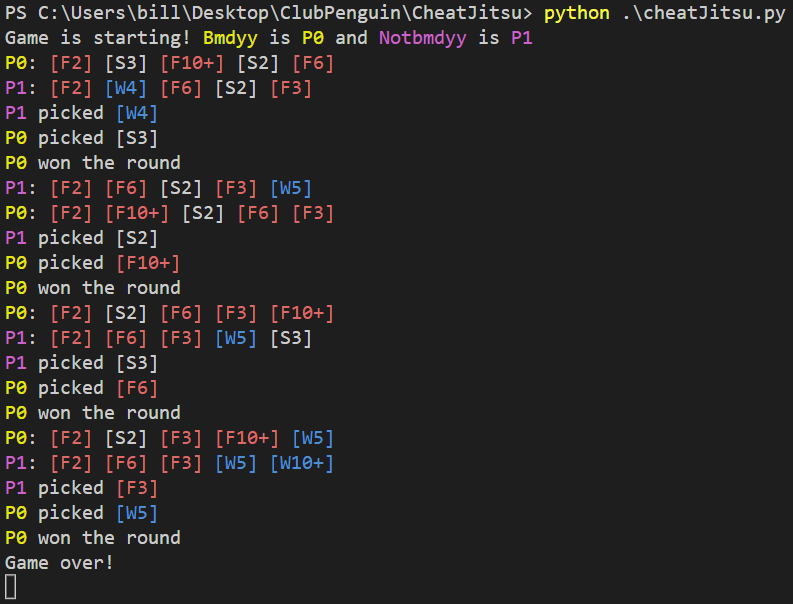

# CheatJitsu



## What?

Card-Jitsu is one of the minigames in Club Penguin. This is a program which reveals the opponents hand / picked card to you by sniffing the traffic from the server.

## Why?

For educational purposes. See my YouTube video [here]()

## Documentation (Events)

### Game Start
This event is sent once at the beginning of the game to let us know which player was assigned to which side.

```
%xt%uz%113%0|Bmdyy|0x2E3C73|2%1|Notbmdyy|0x2E3C73|2%

xt
uz
113
0|Bmdyy|0x2E3C73|2    - Player
1|Notbmdyy|0x2E3C73|2 - Player

Player:
0        - Player.Side
Bmdyy    - Player.Name
0x2E3C73 - ?
2        - ?
```

### Game Over
This event is sent once when the game is over.

```
%xt%cjsi%113%230|242|244|238%4%10%

xt
cjsi
113
230|242|244|238 - ?
4               - ?
10              - ?
```

### Deal
This event is sent when cards are dealt out to a player.

```
%xt%zm%113%deal%0%15|23|w|2|g|0%

xt
zm
113
deal
0             - Player.Side
15|23|w|2|g|0 - Card

Card:
15 - Card.Number
23 - Card.Id
w  - Card.Element
2  - Card.Value
g  - Card.Color
0  - Card.IsSpecial
```

### Pick
This event is sent when a player picks a card.

```
%xt%zm%113%pick%0%11%

xt
zm
113
pick
0    - Player.Side
11   - Card.Number
```

### Judge
This event is sent to indicate who won the previous round.
The value of playerId is -1 if it is a tie.

```
%xt%zm%113%judge%0%

xt
zm
113
judge
0     - Player.Side OR -1 if tie
```

### Power
This event is sent when a player played (and won with) a 'special' card.

```
%xt%zm%113%power%0%1%1%%

xt
zm
113
power
0     - ?
1     - ?
1     - ?
```